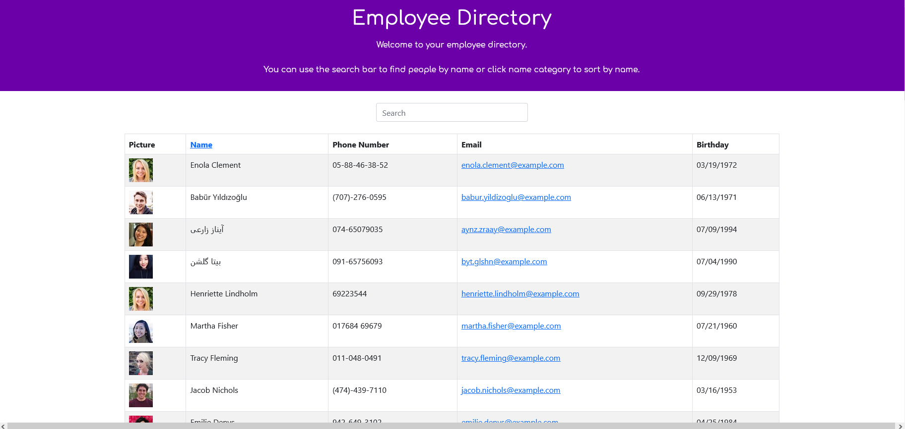

# Employee-Directory


## Description

An employee directory app with details about each employee and can search and sort by name.

## Table of Contents

*[Installation](#installation)

*[Usage](#usage)

*[License](#license)

*[Images](#images)

*[Tests](#tests)

*[Questions](#questions)

## Installation

To install necessary dependencies, run the following command:

```
npm i
```

## Usage

Need to know react.

## License

This project is licensed under the MIT license.

## Images



## Tests

To run tests, run the following command:

```
npm test
```

## Questions

If you have any questions about the repo, open an issue or contact me directly at <a.chisar00@gmail.com>. You can find more of my work at [Arivas00](https://github.com/Arivas00)
